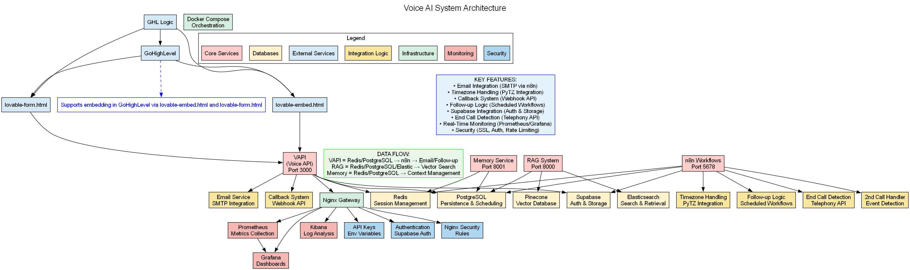

# 🎤 Voice AI System - Complete Setup Guide

## 🚀 Overview

This comprehensive Voice AI system integrates **VAPI** (Voice AI Platform), **n8n** automation, **RAG** (Retrieval-Augmented Generation), and **Memory** components for a complete conversational AI solution.

## 📁 System Architecture

```
voice-ai-system/
├── vapi/                    # VAPI Voice AI Platform
├── n8n/                     # n8n Automation Workflows
├── rag/                     # RAG Knowledge Base
├── memory/                  # Conversation Memory System
├── screenshots/             # Setup Screenshots
├── docker-compose.yml       # Complete System Orchestration
└── setup-guide.md          # Step-by-Step Setup Instructions
```

## 🎯 Components

### 1. **VAPI (Voice AI Platform)**
- Real-time voice conversation capabilities
- Multi-language support
- Custom voice models
- Webhook integration with n8n

### 2. **n8n Automation**
- Workflow orchestration
- API integrations
- Data processing pipelines
- Event-driven automation

### 3. **RAG (Retrieval-Augmented Generation)**
- Knowledge base management
- Semantic search
- Context-aware responses
- Document processing

### 4. **Memory System**
- Conversation history
- User preferences
- Context persistence
- Session management

## 🛠️ Quick Start

### Prerequisites
- Docker and Docker Compose
- Node.js 18+
- [Rust (required for building some Python packages)](https://rustup.rs/)
- [Python 3.11.9](https://www.python.org/downloads/release/python-3119/)
- API Keys (VAPI, OpenAI, etc.)

### Installation
```bash

# Clone and setup
git clone <repository>
cd voice-ai-system

# Navigate to the project directory
cd "D:\GHLSitesTest\voice-ai-system"

# Copy environment template and configure
copy env.example .env
# Edit .env file with your API keys

# Start all services
docker-compose up -d

# Or use the startup script
.\start-system.ps1

# Access services
# VAPI Dashboard: http://localhost:3000
# n8n Dashboard: http://localhost:5678
# RAG API: http://localhost:8000
# Memory API: http://localhost:8001
```

## 📸 Screenshots

### VAPI Dashboard
<table>
  <tr>
    <td></td>
  </tr>
</table>

### n8n Workflow
<table>
  <tr>
    <td></td>
  </tr>
</table>

### Pinecone Dashboard
<table>
  <tr>
    <td></td>
  </tr>
</table>

### RAG Knowledge Base
<table>
  <tr>
    <td></td>
  </tr>
</table>

### Memory Management
<table>
  <tr>
    <td></td>
  </tr>
</table>

### Elastic Management
<table>
  <tr>
    <td></td>
  </tr>
</table>

### System Architecture
<table>
  <tr>
    <td></td>
  </tr>
</table>

### Voice AI System Architecture
<table>
  <tr>
    <td></td>
  </tr>
</table>

### LovableEmbed GoHighLevel Voice AI System Architecture
<table>
  <tr>
    <td></td>
  </tr>
</table>


## 🔧 Configuration

### Environment Variables
```env
# VAPI Configuration
VAPI_API_KEY=your_vapi_key
VAPI_PROJECT_ID=your_project_id

# n8n Configuration
N8N_BASIC_AUTH_ACTIVE=true
N8N_BASIC_AUTH_USER=admin
N8N_BASIC_AUTH_PASSWORD=secure_password

# RAG Configuration
OPENAI_API_KEY=your_openai_key
PINECONE_API_KEY=your_pinecone_key
PINECONE_ENVIRONMENT=your_environment

# Memory Configuration
REDIS_URL=redis://localhost:6379
MEMORY_TTL=86400
```

## 📊 Features

### Voice AI Capabilities
- ✅ Real-time voice conversations
- ✅ Multi-language support
- ✅ Custom voice models
- ✅ Emotion detection
- ✅ Speaker identification

### Automation Features
- ✅ Workflow orchestration
- ✅ API integrations
- ✅ Event-driven triggers
- ✅ Data processing
- ✅ Error handling

### RAG Features
- ✅ Document ingestion
- ✅ Semantic search
- ✅ Context retrieval
- ✅ Knowledge base management
- ✅ Real-time updates

### Memory Features
- ✅ Conversation history
- ✅ User preferences
- ✅ Context persistence
- ✅ Session management
- ✅ Memory optimization

## 🔗 API Endpoints

### VAPI Endpoints
- `POST /vapi/assistants` - Create assistant
- `POST /vapi/phone-calls` - Initiate call
- `GET /vapi/phone-calls/{id}` - Get call status

### n8n Webhooks
- `POST /webhook/voice-trigger` - Voice event trigger
- `POST /webhook/rag-query` - RAG query processing
- `POST /webhook/memory-update` - Memory updates

### RAG API
- `POST /rag/query` - Query knowledge base
- `POST /rag/ingest` - Ingest documents
- `GET /rag/documents` - List documents

### Memory API
- `GET /memory/{user_id}` - Get user memory
- `POST /memory/{user_id}` - Update memory
- `DELETE /memory/{user_id}` - Clear memory

## 🧪 Testing

### Voice Testing
```bash
# Test voice call
curl -X POST http://localhost:3000/vapi/phone-calls \
  -H "Authorization: Bearer $VAPI_API_KEY" \
  -d '{"assistant_id": "your_assistant_id", "phone_number": "+1234567890"}'
```

### n8n Testing
```bash
# Test webhook
curl -X POST http://localhost:5678/webhook/voice-trigger \
  -H "Content-Type: application/json" \
  -d '{"event": "voice_call_started", "data": {...}}'
```

### RAG Testing
```bash
# Test RAG query
curl -X POST http://localhost:8000/rag/query \
  -H "Content-Type: application/json" \
  -d '{"query": "What is the company policy on refunds?"}'
```

## 📈 Monitoring

### Health Checks
- VAPI: `http://localhost:3000/health`
- n8n: `http://localhost:5678/healthz`
- RAG: `http://localhost:8000/health`
- Memory: `http://localhost:8001/health`

### Logs
```bash
# View all logs
docker-compose logs -f

# View specific service logs
docker-compose logs -f vapi
docker-compose logs -f n8n
docker-compose logs -f rag
docker-compose logs -f memory
```

## 🔒 Security

### API Security
- JWT authentication
- Rate limiting
- CORS configuration
- Input validation

### Data Security
- Encrypted storage
- Secure API keys
- Audit logging
- Data backup

## 🚀 Deployment

### Production Setup
```bash
# Build production images
docker-compose -f docker-compose.prod.yml build

# Deploy to production
docker-compose -f docker-compose.prod.yml up -d
```

### Environment Variables
```bash
# Copy environment template
cp .env.example .env

# Edit environment variables
nano .env
```

## 📞 Support

### Documentation
- [VAPI Documentation](https://docs.vapi.ai/)
- [n8n Documentation](https://docs.n8n.io/)
- [RAG Implementation Guide](docs/rag-guide.md)
- [Memory System Guide](docs/memory-guide.md)

### Troubleshooting
- Check logs: `docker-compose logs`
- Verify connectivity: `docker-compose ps`
- Test endpoints: Use provided test scripts
- Monitor resources: `docker stats`

---

**Status**: Ready for Production
**Version**: 1.0.0
**Last Updated**: 2025-07-10
