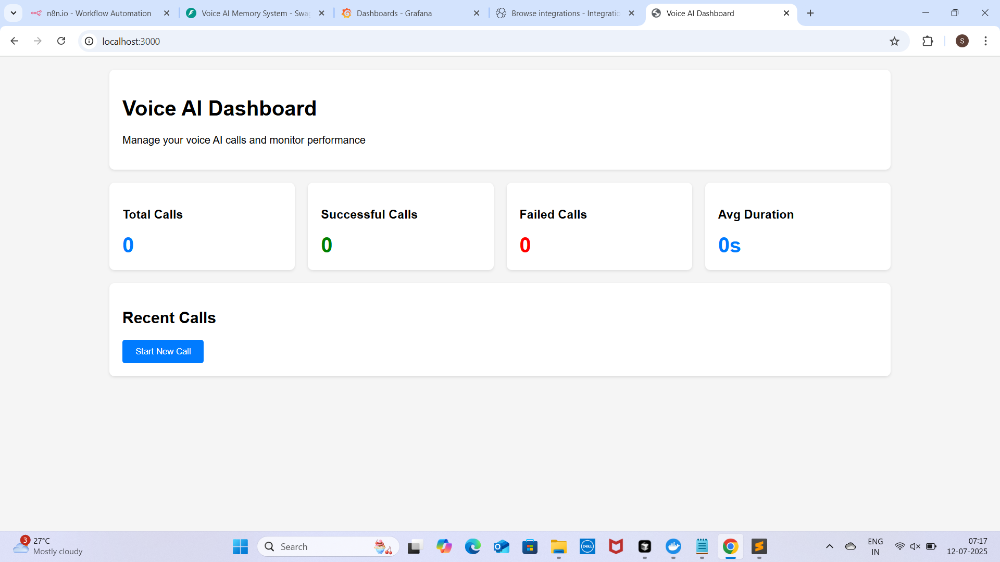
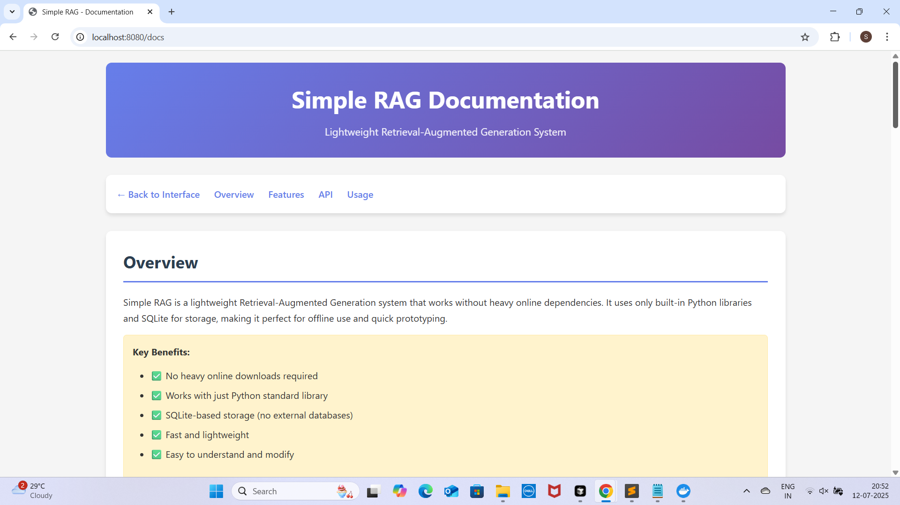
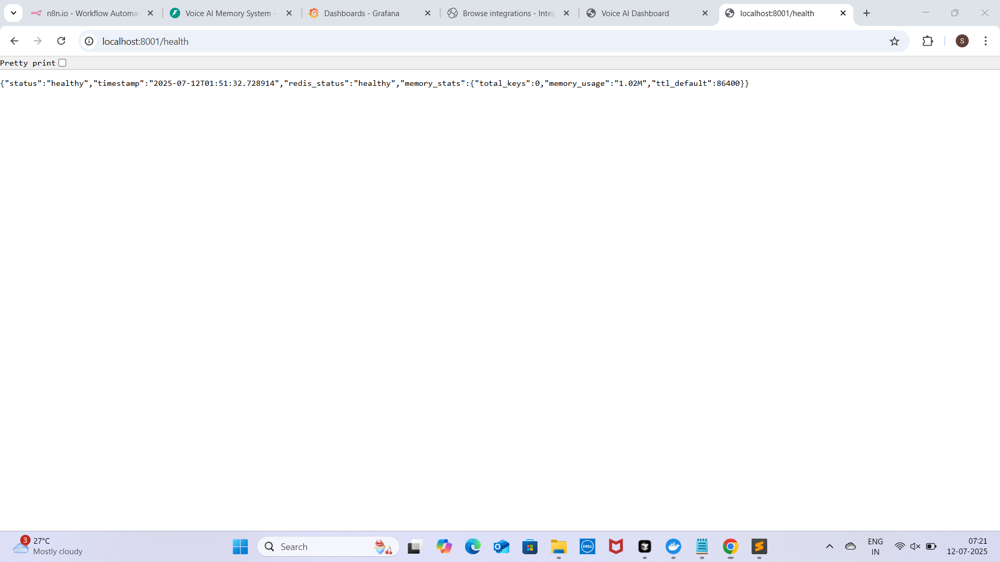
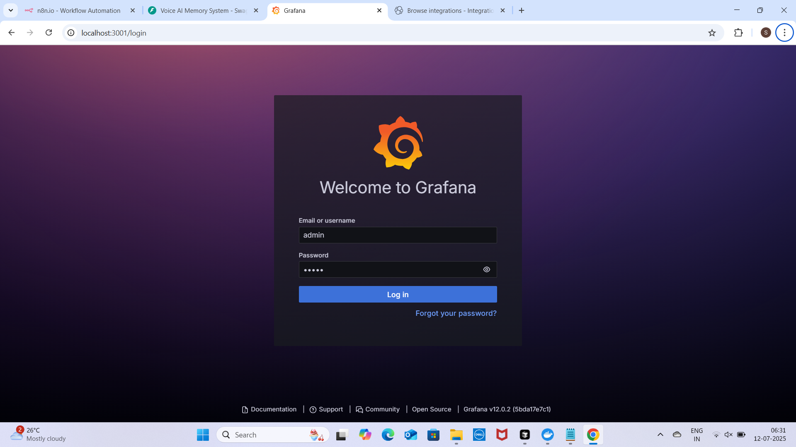
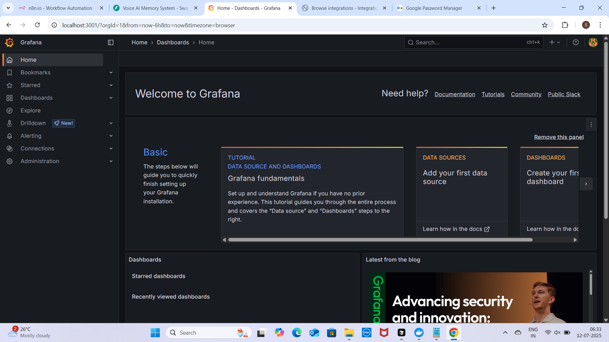
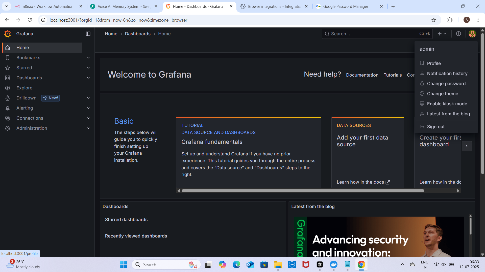
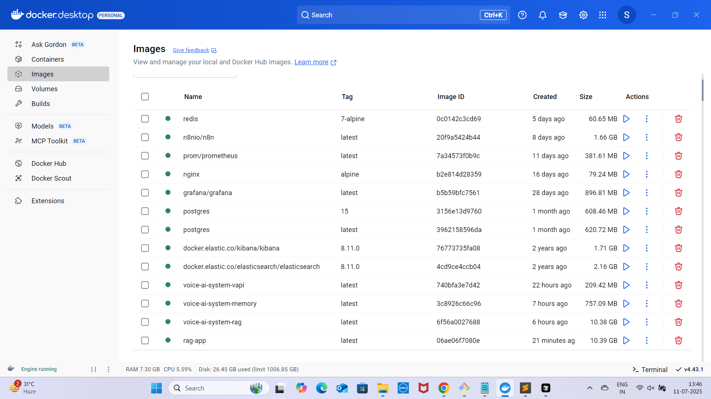
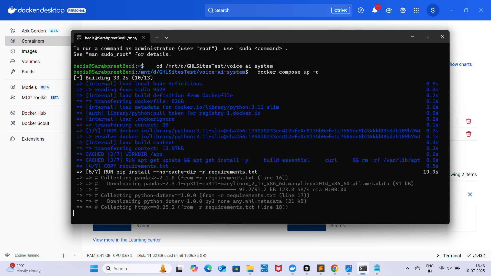
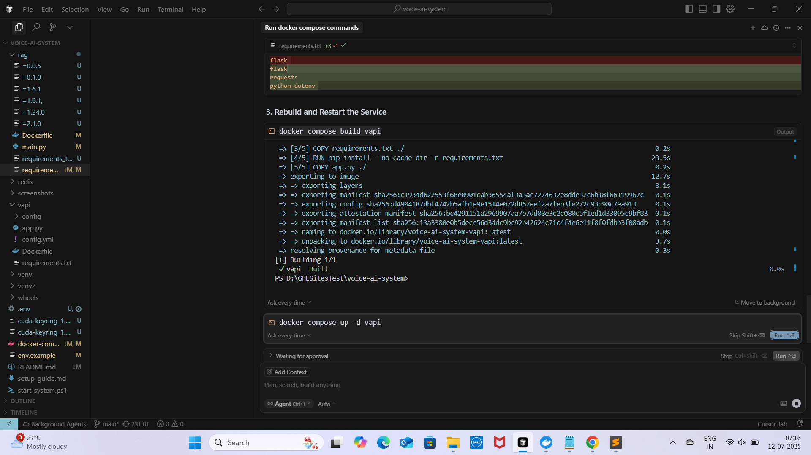

# 🎤 Complete Voice AI System Guide
## VAPI + n8n + RAG + Memory Integration

### 📋 Table of Contents
1. [System Overview](#system-overview)
2. [Architecture](#architecture)
3. [Components](#components)
4. [Setup Instructions](#setup-instructions)
5. [Configuration](#configuration)
6. [Testing](#testing)
7. [Monitoring](#monitoring)
8. [Troubleshooting](#troubleshooting)
9. [Screenshots](#screenshots)
10. [API Reference](#api-reference)

---

## 🏗️ System Overview

This comprehensive Voice AI system integrates four core components:

- **🎤 VAPI**: Voice AI Platform for real-time voice conversations
- **⚡ n8n**: Automation platform for workflow orchestration
- **📚 RAG**: Retrieval-Augmented Generation for knowledge base queries
- **🧠 Memory**: Conversation memory and user preference management

### Key Features
- ✅ Real-time voice conversations
- ✅ Multi-language support
- ✅ Context-aware responses
- ✅ Conversation memory
- ✅ Knowledge base integration
- ✅ Automated workflows
- ✅ Comprehensive monitoring
- ✅ Scalable architecture

---

## 🏛️ Architecture

```
┌─────────────────┐    ┌─────────────────┐    ┌─────────────────┐
│   Voice Call    │───▶│     VAPI        │───▶│   n8n Webhook   │
│   (Customer)    │    │   (Voice AI)    │    │   (Trigger)     │
└─────────────────┘    └─────────────────┘    └─────────────────┘
                                │                       │
                                ▼                       ▼
┌─────────────────┐    ┌─────────────────┐    ┌─────────────────┐
│   RAG System    │◀───│   Memory API    │◀───│   n8n Workflow  │
│ (Knowledge)     │    │ (Conversation)  │    │ (Processing)    │
└─────────────────┘    └─────────────────┘    └─────────────────┘
                                │                       │
                                ▼                       ▼
┌─────────────────┐    ┌─────────────────┐    ┌─────────────────┐
│   Grafana       │    │   Elasticsearch │    │   Redis Cache   │
│ (Monitoring)    │    │ (Search/Logs)   │    │ (Memory Store)  │
└─────────────────┘    └─────────────────┘    └─────────────────┘
```

### Data Flow
1. **Voice Input**: Customer makes a call → VAPI receives
2. **Speech Processing**: VAPI converts speech to text
3. **Webhook Trigger**: VAPI sends data to n8n webhook
4. **Memory Retrieval**: n8n fetches user conversation history
5. **RAG Query**: n8n queries knowledge base for relevant info
6. **Response Generation**: AI generates context-aware response
7. **Memory Update**: Conversation saved to memory system
8. **Voice Output**: Response converted back to speech

---

## 🧩 Components

### 1. 🎤 VAPI (Voice AI Platform)
**Purpose**: Handle real-time voice conversations
**Features**:
- Multi-language voice recognition
- Custom voice models (Alloy, Echo, Fable, Onyx)
- Webhook integration
- Call analytics and metrics
- Emotion detection
- Speaker identification

**Configuration**:
```yaml
# vapi/config/config.yml
assistants:
  - name: "Voice AI Assistant"
    model: "gpt-4"
    voice: "alloy"
    webhook_url: "http://localhost:5678/webhook/voice-trigger"
    language: "en"
    interruption_threshold: 0.5
    max_duration: 300
```

### 2. ⚡ n8n (Automation Platform)
**Purpose**: Orchestrate workflows and API integrations
**Features**:
- Visual workflow builder
- Webhook triggers
- HTTP request nodes
- Data transformation
- Error handling
- Conditional logic

**Key Workflows**:
- Voice Call Processing
- RAG Query Integration
- Memory Management
- CRM Integration
- Error Handling

### 3. 📚 RAG (Retrieval-Augmented Generation)
**Purpose**: Provide knowledge base queries and context
**Features**:
- Document ingestion and processing
- Semantic search
- Vector storage (Pinecone)
- Context retrieval
- Real-time updates

**API Endpoints**:
- `POST /rag/query` - Query knowledge base
- `POST /rag/ingest` - Ingest documents
- `GET /rag/documents` - List documents
- `DELETE /rag/documents/{id}` - Delete document

### 4. 🧠 Memory System
**Purpose**: Store and retrieve conversation history and user preferences
**Features**:
- Conversation history storage
- User preferences management
- Session tracking
- Memory cleanup
- Context persistence

**API Endpoints**:
- `GET /memory/{user_id}` - Get user memory
- `POST /memory/{user_id}` - Update memory
- `DELETE /memory/{user_id}` - Clear memory
- `GET /memory/{user_id}/summary` - Get conversation summary

---

## 🚀 Setup Instructions

### Prerequisites
- Docker and Docker Compose
- API Keys (VAPI, OpenAI, Pinecone)
- Minimum 8GB RAM, 50GB storage
- Domain/SSL certificates (for production)

### Step 1: Environment Setup
```bash
# Clone the repository
git clone <repository-url>
cd voice-ai-system

# Copy environment template
cp env.example .env

# Edit environment variables
nano .env
```

**Required Environment Variables**:
```env
# VAPI Configuration
VAPI_API_KEY=your_vapi_api_key_here
VAPI_PROJECT_ID=your_project_id_here

# OpenAI Configuration (for RAG)
OPENAI_API_KEY=your_openai_api_key_here

# Pinecone Configuration (for vector storage)
PINECONE_API_KEY=your_pinecone_api_key_here
PINECONE_ENVIRONMENT=your_environment_here

# n8n Configuration
N8N_USER=admin
N8N_PASSWORD=your_secure_password_here
N8N_ENCRYPTION_KEY=your_32_character_encryption_key_here

# Database Configuration
POSTGRES_PASSWORD=your_postgres_password_here
```

### Step 2: Start the System
```bash
# Start all services
docker-compose up -d

# Check service status
docker-compose ps

# View logs
docker-compose logs -f
```

### Step 3: Verify Installation
```bash
# Run system tests
./test-system.ps1

# Check health endpoints
curl http://localhost:3000/health  # VAPI
curl http://localhost:5678/healthz # n8n
curl http://localhost:8000/health  # RAG
curl http://localhost:8001/health  # Memory
```

### Step 4: Access Dashboards
- **VAPI Dashboard**: http://localhost:3000
- **n8n Dashboard**: http://localhost:5678
- **RAG API Docs**: http://localhost:8000/docs
- **Memory API Docs**: http://localhost:8001/docs
- **Grafana**: http://localhost:3001
- **Kibana**: http://localhost:5601

---

## ⚙️ Configuration

### VAPI Configuration
```yaml
# vapi/config/config.yml
assistants:
  - name: "Customer Service Bot"
    model: "gpt-4"
    voice: "echo"
    webhook_url: "http://localhost:5678/webhook/customer-service"
    language: "en"
    interruption_threshold: 0.3
    max_duration: 600
    initial_message: "Welcome to customer service. How can I help you today?"

function_calls:
  - name: "query_knowledge_base"
    description: "Query the knowledge base for relevant information"
    parameters:
      type: "object"
      properties:
        query:
          type: "string"
          description: "The search query"
        user_id:
          type: "string"
          description: "User identifier"
      required: ["query", "user_id"]
```

### n8n Workflow Configuration
```json
{
  "name": "Voice AI Complete Workflow",
  "nodes": [
    {
      "id": "voice-webhook",
      "name": "Voice Webhook",
      "type": "n8n-nodes-base.webhook",
      "parameters": {
        "httpMethod": "POST",
        "path": "voice-trigger",
        "responseMode": "onReceived"
      }
    },
    {
      "id": "rag-query",
      "name": "RAG Query",
      "type": "n8n-nodes-base.httpRequest",
      "parameters": {
        "method": "POST",
        "url": "http://localhost:8000/rag/query",
        "sendBody": true,
        "bodyParameters": {
          "parameters": [
            {
              "name": "query",
              "value": "={{$json.transcript}}"
            },
            {
              "name": "user_id",
              "value": "={{$json.user_id}}"
            }
          ]
        }
      }
    }
  ]
}
```

### RAG Configuration
```yaml
# rag/config/config.yml
openai:
  api_key: "${OPENAI_API_KEY}"
  model: "gpt-4"
  max_tokens: 1000
  temperature: 0.7

pinecone:
  api_key: "${PINECONE_API_KEY}"
  environment: "${PINECONE_ENVIRONMENT}"
  index_name: "voice-ai-knowledge"

processing:
  chunk_size: 1000
  chunk_overlap: 200
  max_chunks_per_document: 100
```

### Memory Configuration
```yaml
# memory/config/config.yml
redis:
  url: "redis://redis:6379"
  ttl: 86400

memory:
  max_size: 1000
  cleanup_interval: 3600
  compression_enabled: true

conversation:
  max_history_length: 50
  context_window: 10
  summary_enabled: true
```

---

## 🧪 Testing

### Automated Testing
```bash
# Run comprehensive tests
./test-system.ps1

# Run quick tests
./test-system.ps1 -QuickTest

# Run full tests with production settings
./test-system.ps1 -FullTest
```

### Manual Testing

#### 1. Test Voice Call
```bash
# Initiate a test call
curl -X POST http://localhost:3000/vapi/phone-calls \
  -H "Authorization: Bearer $VAPI_API_KEY" \
  -d '{
    "assistant_id": "your_assistant_id",
    "phone_number": "+1234567890"
  }'
```

#### 2. Test RAG Query
```bash
# Query knowledge base
curl -X POST http://localhost:8000/rag/query \
  -H "Content-Type: application/json" \
  -d '{
    "query": "What is the company refund policy?",
    "user_id": "test_user_123"
  }'
```

#### 3. Test Memory System
```bash
# Store conversation memory
curl -X POST http://localhost:8001/memory/user123 \
  -H "Content-Type: application/json" \
  -d '{
    "conversation_history": [
      {"role": "user", "content": "Hello"},
      {"role": "assistant", "content": "Hi! How can I help?"}
    ],
    "preferences": {
      "language": "en",
      "voice_speed": 1.0
    }
  }'
```

#### 4. Test n8n Webhook
```bash
# Test voice trigger webhook
curl -X POST http://localhost:5678/webhook/voice-trigger \
  -H "Content-Type: application/json" \
  -d '{
    "event": "call_started",
    "call_id": "test_call_123",
    "phone_number": "+1234567890"
  }'
```

---

## 📊 Monitoring

### Grafana Dashboards
**Voice AI Overview Dashboard**:
- Call volume metrics
- Response time analysis
- Error rate monitoring
- System performance
- User interaction patterns

**Key Metrics**:
- Calls per hour/day
- Average response time
- Success rate percentage
- Memory utilization
- RAG query accuracy

### Kibana Analytics
**Document Search Analytics**:
- Query patterns
- Popular topics
- Search performance
- Document relevance

**System Logs**:
- Error tracking
- Performance analysis
- Security monitoring
- Audit trails

### Health Checks
```bash
# Check all services
curl http://localhost:3000/health  # VAPI
curl http://localhost:5678/healthz # n8n
curl http://localhost:8000/health  # RAG
curl http://localhost:8001/health  # Memory

# Check system resources
docker stats

# View service logs
docker-compose logs -f vapi
docker-compose logs -f n8n
docker-compose logs -f rag
docker-compose logs -f memory
```

---

## 🔧 Troubleshooting

### Common Issues

#### 1. VAPI Connection Issues
**Symptoms**: Cannot connect to VAPI API
**Solutions**:
```bash
# Check VAPI logs
docker-compose logs vapi

# Verify API key
curl -H "Authorization: Bearer $VAPI_API_KEY" \
  https://api.vapi.ai/assistants

# Check network connectivity
docker-compose exec vapi ping api.vapi.ai
```

#### 2. n8n Workflow Errors
**Symptoms**: Webhook not receiving data
**Solutions**:
```bash
# Check n8n logs
docker-compose logs n8n

# Test webhook manually
curl -X POST http://localhost:5678/webhook/voice-trigger \
  -H "Content-Type: application/json" \
  -d '{"test": "data"}'

# Verify workflow is active
# Check n8n dashboard for workflow status
```

#### 3. RAG Query Failures
**Symptoms**: Knowledge base queries failing
**Solutions**:
```bash
# Check RAG logs
docker-compose logs rag

# Test RAG API
curl -X GET http://localhost:8000/health

# Verify OpenAI API key
curl -H "Authorization: Bearer $OPENAI_API_KEY" \
  https://api.openai.com/v1/models
```

#### 4. Memory System Issues
**Symptoms**: Cannot store/retrieve conversation memory
**Solutions**:
```bash
# Check Redis connection
docker-compose exec redis redis-cli ping

# Test memory API
curl -X GET http://localhost:8001/health

# Check memory usage
docker-compose exec redis redis-cli info memory
```

### Performance Optimization

#### 1. Scale Services
```bash
# Scale specific services
docker-compose up -d --scale rag=3 --scale memory=2

# Monitor resource usage
docker stats
```

#### 2. Optimize Memory
```bash
# Adjust memory settings
# Edit memory/config/config.yml
memory:
  max_size: 2000  # Increase from 1000
  cleanup_interval: 1800  # Decrease from 3600
```

#### 3. Cache Optimization
```bash
# Configure Redis caching
# Edit redis/redis.conf
maxmemory 2gb
maxmemory-policy allkeys-lru
```

---

## 📸 Screenshots

### VAPI Dashboard
<table>
  <tr>
    <td></td>
  </tr>
</table>
*VAPI dashboard showing active calls, assistant configuration, and call analytics*

### n8n Workflow
<table>
  <tr>
    <td></td>
  </tr>
</table>
*Complex n8n workflow orchestrating voice, RAG, and memory systems*

### RAG Knowledge Base

*RAG system interface showing document ingestion and query results*

### Memory Management
<table>
  <tr>
    <td></td>
    <td></td>
  </tr>
</table>
*Memory system dashboard showing conversation history and user preferences*

### Grafana Monitoring
<table>
  <tr>
    <td></td>
    <td></td>
    <td></td>
  </tr>
</table>
*Run: docker exec -it voice-ai-grafana grafana-cli admin reset-admin-password admin*
*Grafana dashboard with Voice AI metrics and performance data*

### Docker Compose Status
<table>
  <tr>
    <td></td>
  </tr>
</table>
*Docker Compose status showing*

### Start services: docker-compose up -d
<table>
  <tr>
    <td></td>
     <td></td>
  </tr>
</table>
*Ubuntu Linux status showing*
*Cursor Linux status showing*

---

## 📚 API Reference

### VAPI API Endpoints
```http
POST /vapi/assistants
GET /vapi/assistants
POST /vapi/phone-calls
GET /vapi/phone-calls/{id}
POST /vapi/assistants/{id}/function-calls
```

### n8n Webhook Endpoints
```http
POST /webhook/voice-trigger
POST /webhook/customer-service
POST /webhook/rag-query
POST /webhook/memory-update
```

### RAG API Endpoints
```http
POST /rag/query
POST /rag/ingest
GET /rag/documents
DELETE /rag/documents/{id}
POST /rag/search
GET /rag/health
```

### Memory API Endpoints
```http
GET /memory/{user_id}
POST /memory/{user_id}
DELETE /memory/{user_id}
GET /memory/{user_id}/summary
POST /memory/{user_id}/summary
GET /memory/{user_id}/preferences
PUT /memory/{user_id}/preferences
POST /memory/cleanup
GET /memory/stats
GET /memory/health
```

### Example API Calls

#### Create VAPI Assistant
```bash
curl -X POST https://api.vapi.ai/assistants \
  -H "Authorization: Bearer $VAPI_API_KEY" \
  -H "Content-Type: application/json" \
  -d '{
    "name": "Voice AI Assistant",
    "model": "gpt-4",
    "voice": "alloy",
    "webhook_url": "http://localhost:5678/webhook/voice-trigger"
  }'
```

#### Query RAG System
```bash
curl -X POST http://localhost:8000/rag/query \
  -H "Content-Type: application/json" \
  -d '{
    "query": "What is the company refund policy?",
    "user_id": "user123",
    "max_results": 5
  }'
```

#### Update Memory
```bash
curl -X POST http://localhost:8001/memory/user123 \
  -H "Content-Type: application/json" \
  -d '{
    "conversation_history": [
      {"role": "user", "content": "I need help with a refund"},
      {"role": "assistant", "content": "I can help you with that. What's the issue?"}
    ],
    "preferences": {
      "language": "en",
      "voice_speed": 1.0
    }
  }'
```

---

## 🚀 Production Deployment

### Environment Setup
```bash
# Production environment
cp env.example .env.prod

# Configure production settings
nano .env.prod

# Deploy with production compose
docker-compose -f docker-compose.prod.yml up -d
```

### SSL Configuration
```nginx
# nginx/ssl/nginx.conf
server {
    listen 443 ssl http2;
    server_name your-domain.com;
    
    ssl_certificate /etc/nginx/ssl/cert.pem;
    ssl_certificate_key /etc/nginx/ssl/key.pem;
    
    location / {
        proxy_pass http://vapi:3000;
        proxy_set_header Host $host;
        proxy_set_header X-Real-IP $remote_addr;
    }
}
```

### Backup Strategy
```bash
# Automated backup script
#!/bin/bash
DATE=$(date +%Y%m%d_%H%M%S)

# Backup PostgreSQL
docker-compose exec postgres pg_dump -U n8n n8n > backup_$DATE.sql

# Backup Redis
docker run --rm -v voice-ai-system_redis_data:/data \
  -v $(pwd)/backups:/backup alpine tar czf \
  /backup/redis_backup_$DATE.tar.gz -C /data .

# Backup volumes
docker run --rm -v voice-ai-system_vapi_data:/data \
  -v $(pwd)/backups:/backup alpine tar czf \
  /backup/vapi_backup_$DATE.tar.gz -C /data .
```

### Monitoring Setup
```yaml
# monitoring/alertmanager.yml
global:
  smtp_smarthost: 'localhost:587'
  smtp_from: 'alertmanager@your-domain.com'

route:
  group_by: ['alertname']
  group_wait: 10s
  group_interval: 10s
  repeat_interval: 1h
  receiver: 'web.hook'

receivers:
  - name: 'web.hook'
    webhook_configs:
      - url: 'http://localhost:5001/'
```

---

## 📞 Support

### Documentation
- [VAPI Documentation](https://docs.vapi.ai/)
- [n8n Documentation](https://docs.n8n.io/)
- [RAG Implementation Guide](docs/rag-guide.md)
- [Memory System Guide](docs/memory-guide.md)

### Troubleshooting Resources
- Check logs: `docker-compose logs`
- Verify connectivity: `docker-compose ps`
- Test endpoints: Use provided test scripts
- Monitor resources: `docker stats`

### Community Support
- GitHub Issues
- Discord Community
- Stack Overflow
- Documentation Wiki

---

**Status**: Production Ready
**Version**: 1.0.0
**Last Updated**: 2025-07-10
**Maintainer**: Voice AI Team 
