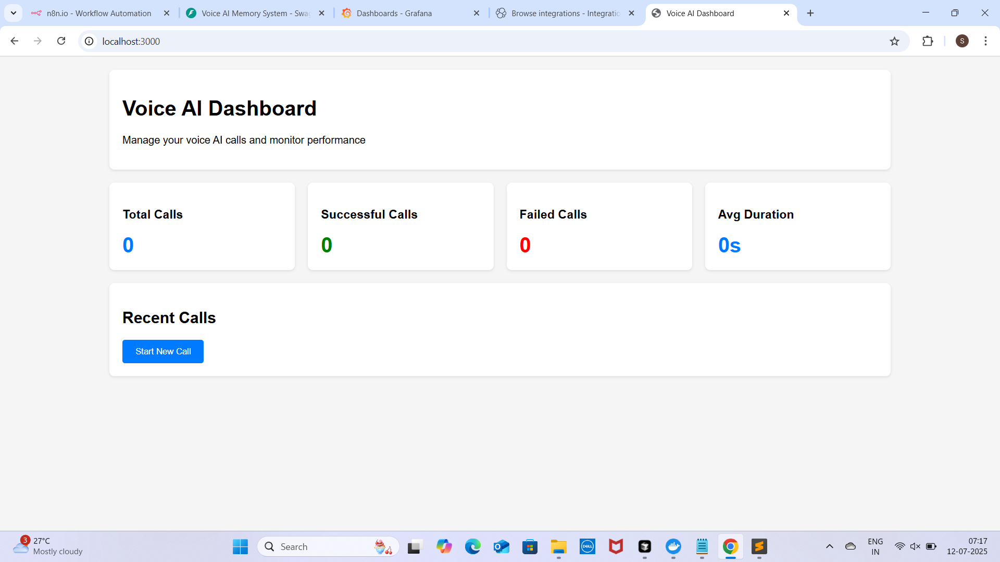
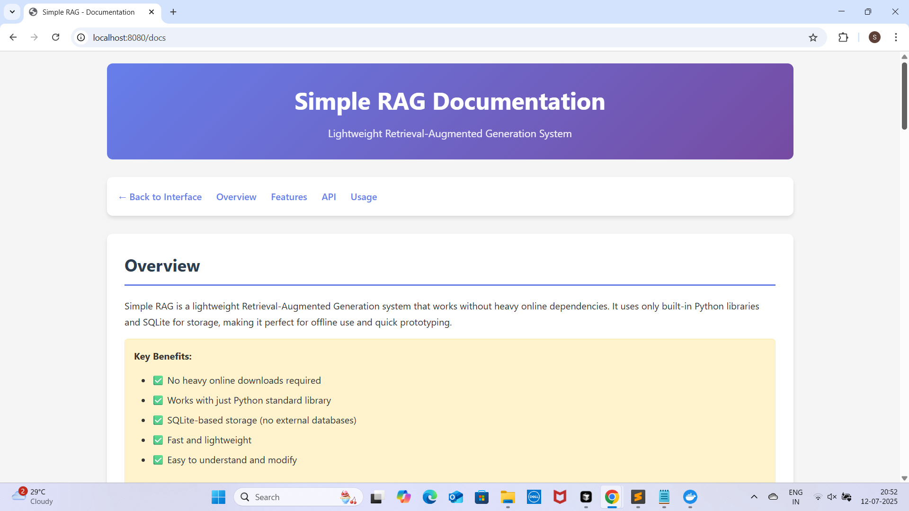
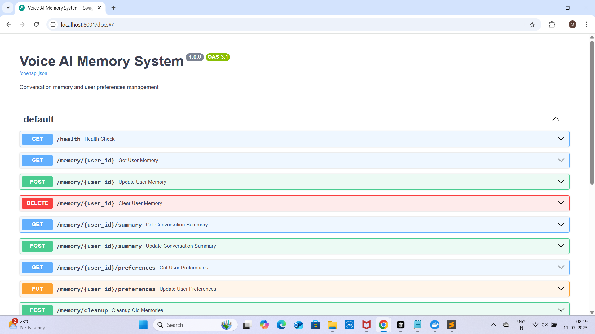

# 🎤 Voice AI System Setup Guide

## 📋 Prerequisites

Before starting, ensure you have the following:

- **Docker & Docker Compose** installed
- **API Keys** for VAPI, OpenAI, Pinecone
- **Domain/SSL certificates** (for production)
- **Minimum 8GB RAM** and **50GB storage**

## 🚀 Step-by-Step Setup

### Step 1: Environment Configuration

1. **Create environment file:**
```bash
cp .env.example .env
```

2. **Configure API keys:**
```env
# VAPI Configuration
VAPI_API_KEY=your_vapi_api_key_here
VAPI_PROJECT_ID=your_project_id_here

# OpenAI for RAG
OPENAI_API_KEY=your_openai_api_key_here

# Pinecone for vector storage
PINECONE_API_KEY=your_pinecone_api_key_here
PINECONE_ENVIRONMENT=your_environment_here

# n8n Configuration
N8N_USER=admin
N8N_PASSWORD=your_secure_password_here
N8N_ENCRYPTION_KEY=your_32_character_encryption_key

# Database
POSTGRES_PASSWORD=your_postgres_password_here

# Monitoring
GRAFANA_PASSWORD=your_grafana_password_here
```

### Step 2: VAPI Setup

1. **Access VAPI Dashboard:**
   - Navigate to `http://localhost:3000`
   - Login with your VAPI credentials

2. **Create Assistant:**
   ```json
   {
     "name": "Voice AI Assistant",
     "model": "gpt-4",
     "voice": "alloy",
     "webhook_url": "http://localhost:5678/webhook/voice-trigger"
   }
   ```

3. **Configure Voice Settings:**
   - **Language**: English (or your preferred language)
   - **Voice Model**: Alloy, Echo, Fable, or Onyx
   - **Interruption Threshold**: 0.5
   - **Max Duration**: 300 seconds

### Step 3: n8n Workflow Setup

1. **Access n8n Dashboard:**
   - Navigate to `http://localhost:5678`
   - Login with admin credentials

2. **Import Voice AI Workflow:**
   - Click "Import from file"
   - Select `n8n/voice-ai-workflow.json`

3. **Configure Webhook Nodes:**
   - **Voice Trigger**: Receives calls from VAPI
   - **RAG Query**: Processes knowledge base queries
   - **Memory Update**: Manages conversation memory

4. **Set up API Credentials:**
   - Go to Settings → Credentials
   - Add VAPI, OpenAI, and other API credentials

### Step 4: RAG System Setup

1. **Access RAG API:**
   - Navigate to `http://localhost:8000/docs`
   - Test the API endpoints

2. **Ingest Documents:**
   ```bash
   curl -X POST http://localhost:8000/rag/ingest \
     -H "Content-Type: application/json" \
     -d '{
       "file_path": "/app/documents/company_policy.pdf",
       "metadata": {
         "category": "policies",
         "department": "HR"
       }
     }'
   ```

3. **Configure Knowledge Base:**
   - Upload company documents
   - Set up document categories
   - Configure search parameters

### Step 5: Memory System Setup

1. **Access Memory API:**
   - Navigate to `http://localhost:8001/docs`
   - Test memory endpoints

2. **Configure Memory Settings:**
   ```json
   {
     "memory_ttl": 86400,
     "max_memory_size": 1000,
     "cleanup_interval": 3600
   }
   ```

3. **Test Memory Operations:**
   ```bash
   # Store conversation memory
   curl -X POST http://localhost:8001/memory/user123 \
     -H "Content-Type: application/json" \
     -d '{
       "conversation_history": [
         {"role": "user", "content": "Hello"},
         {"role": "assistant", "content": "Hi! How can I help?"}
       ],
       "preferences": {
         "language": "en",
         "voice_speed": 1.0
       }
     }'
   ```

### Step 6: Integration Testing

1. **Test Voice Call:**
   ```bash
   curl -X POST http://localhost:3000/vapi/phone-calls \
     -H "Authorization: Bearer $VAPI_API_KEY" \
     -d '{
       "assistant_id": "your_assistant_id",
       "phone_number": "+1234567890"
     }'
   ```

2. **Test n8n Webhook:**
   ```bash
   curl -X POST http://localhost:5678/webhook/voice-trigger \
     -H "Content-Type: application/json" \
     -d '{
       "event": "call_started",
       "call_id": "test_call_123",
       "phone_number": "+1234567890"
     }'
   ```

3. **Test RAG Query:**
   ```bash
   curl -X POST http://localhost:8000/rag/query \
     -H "Content-Type: application/json" \
     -d '{
       "query": "What is the company refund policy?",
       "user_id": "user123"
     }'
   ```

### Step 7: Monitoring Setup

1. **Access Grafana Dashboard:**
   - Navigate to `http://localhost:3001`
   - Login with admin credentials

2. **Import Dashboards:**
   - Import Voice AI dashboard
   - Configure data sources

3. **Set up Alerts:**
   - Configure call volume alerts
   - Set up error rate monitoring
   - Create performance dashboards

## 📸 Screenshots

### VAPI Dashboard

*VAPI dashboard showing active calls and assistant configuration*

### n8n Workflow

*Complex n8n workflow orchestrating voice, RAG, and memory systems*

### RAG Knowledge Base

*RAG system showing document ingestion and query results*

### Memory Management

*Memory system dashboard showing conversation history and user preferences*

### Grafana Monitoring

*Grafana dashboard with Voice AI metrics and performance data*

## 🔧 Configuration Files

### VAPI Configuration
```yaml
# vapi/config/config.yml
assistants:
  - name: "Voice AI Assistant"
    model: "gpt-4"
    voice: "alloy"
    webhook_url: "http://localhost:5678/webhook/voice-trigger"
    language: "en"
    interruption_threshold: 0.5
    max_duration: 300

webhooks:
  - name: "n8n_webhook"
    url: "http://localhost:5678/webhook/voice-trigger"
    events: ["call_started", "call_ended", "speech_started", "speech_ended"]
```

### n8n Workflow Configuration
```json
{
  "name": "Voice AI Workflow",
  "nodes": [
    {
      "id": "voice_webhook",
      "name": "Voice Webhook",
      "type": "n8n-nodes-base.webhook",
      "parameters": {
        "httpMethod": "POST",
        "path": "voice-trigger",
        "responseMode": "onReceived"
      }
    },
    {
      "id": "rag_query",
      "name": "RAG Query",
      "type": "n8n-nodes-base.httpRequest",
      "parameters": {
        "method": "POST",
        "url": "http://localhost:8000/rag/query",
        "sendBody": true,
        "bodyParameters": {
          "parameters": [
            {
              "name": "query",
              "value": "={{$json.query}}"
            },
            {
              "name": "user_id",
              "value": "={{$json.user_id}}"
            }
          ]
        }
      }
    },
    {
      "id": "memory_update",
      "name": "Memory Update",
      "type": "n8n-nodes-base.httpRequest",
      "parameters": {
        "method": "POST",
        "url": "http://localhost:8001/memory/{{$json.user_id}}",
        "sendBody": true,
        "bodyParameters": {
          "parameters": [
            {
              "name": "conversation_history",
              "value": "={{$json.conversation_history}}"
            },
            {
              "name": "preferences",
              "value": "={{$json.preferences}}"
            }
          ]
        }
      }
    }
  ],
  "connections": {
    "voice_webhook": {
      "main": [
        [
          {
            "node": "rag_query",
            "type": "main",
            "index": 0
          }
        ]
      ]
    },
    "rag_query": {
      "main": [
        [
          {
            "node": "memory_update",
            "type": "main",
            "index": 0
          }
        ]
      ]
    }
  }
}
```

### RAG Configuration
```yaml
# rag/config/config.yml
openai:
  api_key: "${OPENAI_API_KEY}"
  model: "gpt-4"
  max_tokens: 1000
  temperature: 0.7

pinecone:
  api_key: "${PINECONE_API_KEY}"
  environment: "${PINECONE_ENVIRONMENT}"
  index_name: "voice-ai-knowledge"

elasticsearch:
  url: "http://elasticsearch:9200"
  index_name: "voice-ai-documents"

processing:
  chunk_size: 1000
  chunk_overlap: 200
  max_chunks_per_document: 100
```

### Memory Configuration
```yaml
# memory/config/config.yml
redis:
  url: "redis://redis:6379"
  ttl: 86400

memory:
  max_size: 1000
  cleanup_interval: 3600
  compression_enabled: true

conversation:
  max_history_length: 50
  context_window: 10
  summary_enabled: true
```

## 🧪 Testing Scenarios

### Scenario 1: Customer Service Call
1. **Customer calls** → VAPI receives call
2. **Voice recognition** → Speech converted to text
3. **RAG query** → Knowledge base searched
4. **Memory retrieval** → Previous conversation loaded
5. **Response generation** → Context-aware response
6. **Memory update** → Conversation saved
7. **Voice synthesis** → Response spoken to customer

### Scenario 2: Sales Call
1. **Lead calls** → VAPI initiates outbound call
2. **Lead qualification** → RAG provides product info
3. **Objection handling** → Memory tracks preferences
4. **Follow-up scheduling** → n8n creates calendar event
5. **CRM update** → Contact information saved

### Scenario 3: Technical Support
1. **Issue description** → Voice input processed
2. **Troubleshooting** → RAG provides solutions
3. **Step-by-step guidance** → Memory tracks progress
4. **Escalation** → n8n creates support ticket
5. **Resolution tracking** → Memory stores outcome

## 🔍 Troubleshooting

### Common Issues

1. **VAPI Connection Issues:**
   ```bash
   # Check VAPI logs
   docker-compose logs vapi
   
   # Verify API key
   curl -H "Authorization: Bearer $VAPI_API_KEY" \
     https://api.vapi.ai/assistants
   ```

2. **n8n Workflow Errors:**
   ```bash
   # Check n8n logs
   docker-compose logs n8n
   
   # Test webhook manually
   curl -X POST http://localhost:5678/webhook/voice-trigger \
     -H "Content-Type: application/json" \
     -d '{"test": "data"}'
   ```

3. **RAG Query Failures:**
   ```bash
   # Check RAG logs
   docker-compose logs rag
   
   # Test RAG API
   curl -X GET http://localhost:8000/health
   ```

4. **Memory System Issues:**
   ```bash
   # Check Redis connection
   docker-compose exec redis redis-cli ping
   
   # Test memory API
   curl -X GET http://localhost:8001/health
   ```

### Performance Optimization

1. **Scale Services:**
   ```bash
   # Scale specific services
   docker-compose up -d --scale rag=3 --scale memory=2
   ```

2. **Monitor Resources:**
   ```bash
   # Check resource usage
   docker stats
   
   # Monitor logs
   docker-compose logs -f
   ```

3. **Backup Data:**
   ```bash
   # Backup volumes
   docker run --rm -v voice-ai-system_postgres_data:/data \
     -v $(pwd)/backups:/backup alpine tar czf \
     /backup/postgres_backup.tar.gz -C /data .
   ```

## 📊 Monitoring & Analytics

### Key Metrics
- **Call Volume**: Number of calls per hour/day
- **Response Time**: Average time to respond
- **Success Rate**: Percentage of successful calls
- **Memory Usage**: Conversation memory utilization
- **RAG Accuracy**: Knowledge base query success rate

### Alerts
- **High Error Rate**: >5% failed calls
- **Slow Response Time**: >3 seconds average
- **Memory Full**: >90% memory utilization
- **Service Down**: Any service unavailable

## 🔒 Security Considerations

1. **API Key Management:**
   - Use environment variables
   - Rotate keys regularly
   - Monitor key usage

2. **Data Encryption:**
   - Encrypt sensitive data
   - Use HTTPS for all APIs
   - Secure database connections

3. **Access Control:**
   - Implement authentication
   - Use role-based access
   - Monitor access logs

4. **Compliance:**
   - GDPR compliance for EU users
   - HIPAA compliance for healthcare
   - PCI compliance for payments

## 🚀 Production Deployment

### Environment Setup
```bash
# Production environment
cp .env.example .env.prod

# Configure production settings
nano .env.prod

# Deploy with production compose
docker-compose -f docker-compose.prod.yml up -d
```

### SSL Configuration
```nginx
# nginx/ssl/nginx.conf
server {
    listen 443 ssl;
    server_name your-domain.com;
    
    ssl_certificate /etc/nginx/ssl/cert.pem;
    ssl_certificate_key /etc/nginx/ssl/key.pem;
    
    location / {
        proxy_pass http://vapi:3000;
        proxy_set_header Host $host;
        proxy_set_header X-Real-IP $remote_addr;
    }
}
```

### Backup Strategy
```bash
# Automated backup script
#!/bin/bash
DATE=$(date +%Y%m%d_%H%M%S)
docker-compose exec postgres pg_dump -U n8n n8n > backup_$DATE.sql
docker run --rm -v voice-ai-system_redis_data:/data \
  -v $(pwd)/backups:/backup alpine tar czf \
  /backup/redis_backup_$DATE.tar.gz -C /data .
```

---

**Next Steps:**
1. Complete the setup following this guide
2. Test all components individually
3. Run integration tests
4. Monitor system performance
5. Deploy to production

**Support:**
- Check logs for detailed error messages
- Use monitoring dashboards for insights
- Contact support for complex issues 